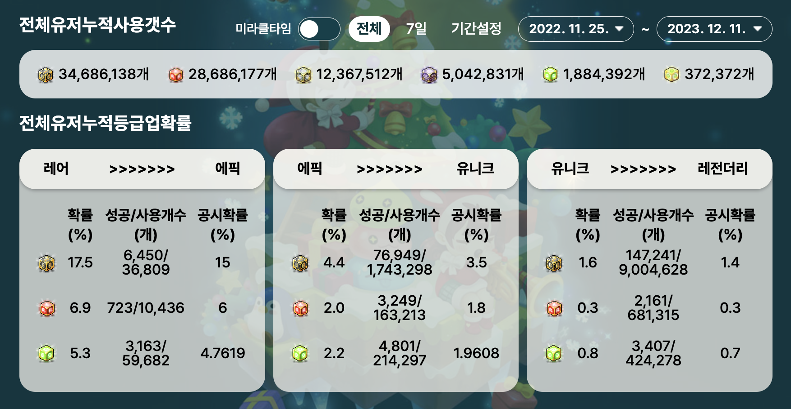

# 메이플 서포트

  

  

# 서비스 소개 
maple open api 를 활용한 사이트 입니다.

  

# 핵심 기능

## 1. 전체 큐브 데이터 

- 서버 별로 큐브 사용량 을 볼 수 있어요.
- 서버 별로 큐브 확률을 볼 수 있어요.
- 서버 별로 전체 사용량 및 확률을 볼 수 있어요

   

## 2. 개인화 데이터 

- 개인의 캐릭터별 사용량 및 확률을 볼 수있어요.
- 개인의 캐릭터별 아이템에 사용한 개수를 볼 수 있어요
- 개인이 사용한 캐쉬 및 메소를 볼 수 있어요.

 
 

# 기술 스택

## 백엔드
- kotlin
- spring boot 3.x
- jpa
- jdbctemplate
- aws
    - ecs
    - ec2
    - fargate
    - elasticache (redis)
    - rds (mysq 2core 4gb memory)
    - sqs
    - lambda
    - sns
    - s3

## 프론트
- ts
- vite
- s3
- cf

## monitoring
- grafana
- pinpoint

 
 

# 기술적 목표

> 현재 기준1억 2천만건에 매일 약40만건씩 증가하는 데이터를 한정적인 (2코어 4기가) 리소스에서
> 안정적으로 저장하고 데이터를 서빙하는것을 목표로 하고 있습니다.
